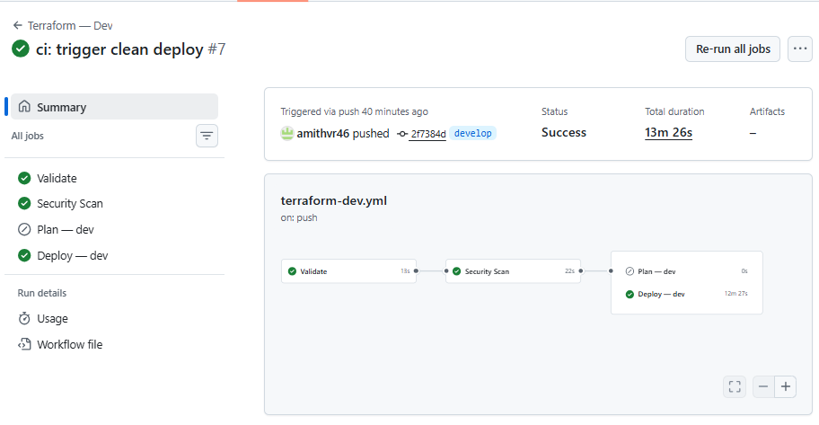
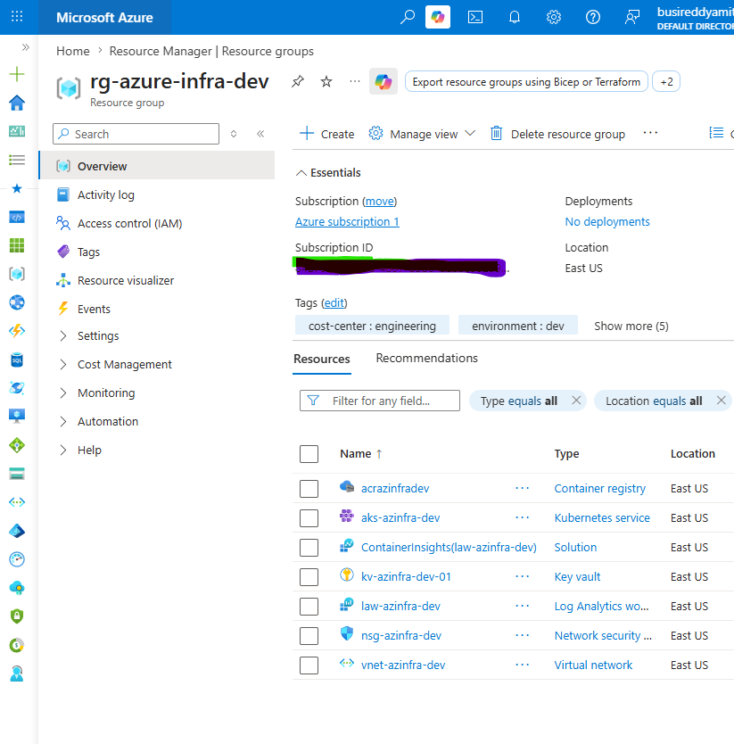
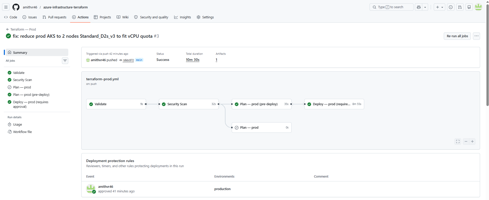
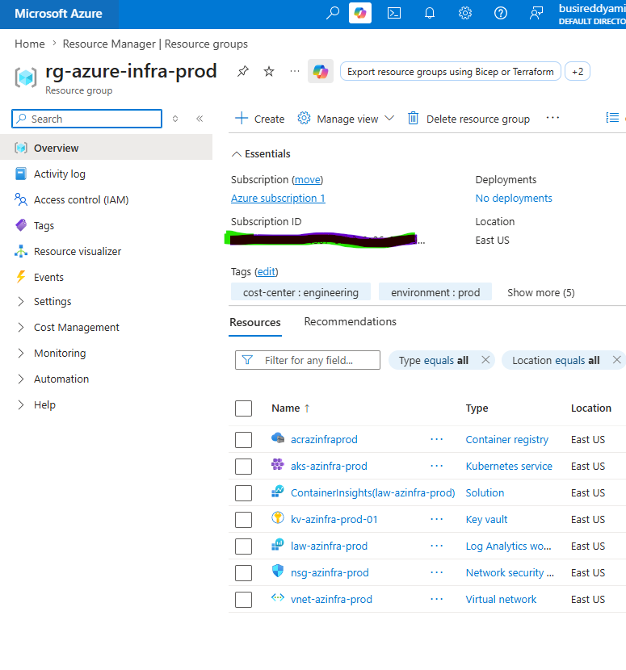

# Azure Infrastructure — Terraform Landing Zone

A production-style Azure Landing Zone built with Terraform. Deploys a fully connected cloud infrastructure using reusable modules, with separate dev and prod environments managed through automated CI/CD pipelines.

**Author:** Amith Busireddy | [LinkedIn](https://linkedin.com/in/amith-busireddy) | [GitHub](https://github.com/amithvr46)

---

## Why This Project

Most cloud engineers say they know Terraform and CI/CD — this project proves it. Everything here is built the way it would be done on a real team:

- Reusable modules, not copy-pasted resources
- Remote state in Azure Blob Storage, not local files
- Separate dev and prod environments, not one hardcoded config
- Pull request pipelines that plan before you deploy
- AI-powered code review and failure analysis on every run
- GitFlow branching so changes are reviewed before they reach production

---

## What It Deploys

One command (via pipeline) provisions a complete Azure platform:

| Resource | Purpose |
|----------|---------|
| **Virtual Network** | Isolated network with 3 subnets (AKS, app, data) and NSG |
| **AKS Cluster** | Kubernetes cluster running inside the VNet with autoscaling |
| **Key Vault** | Secrets management — AKS can pull secrets at runtime |
| **ACR** | Container registry — AKS pulls images from here |
| **Log Analytics** | Monitoring workspace attached to AKS |
| **Remote State Storage** | Azure Blob Storage holding Terraform state for dev and prod |

---

## What's Inside

```
azure-infrastructure-terraform/
├── modules/
│   ├── vnet/          # Virtual Network, subnets, NSG
│   ├── aks/           # AKS cluster + Log Analytics
│   ├── keyvault/      # Key Vault + access policies
│   └── acr/           # Container Registry + AKS pull permissions
├── environments/
│   ├── dev.tfvars     # Dev config — 2 nodes, Standard_D2s_v3
│   └── prod.tfvars    # Prod config — 2 nodes, Standard_D2s_v3, Premium ACR
├── bootstrap/         # One-time setup for remote state storage
├── .github/workflows/
│   ├── terraform-dev.yml          # Dev pipeline (PR + deploy)
│   ├── terraform-prod.yml         # Prod pipeline (PR + approval + deploy)
│   ├── ai-pr-review.yml           # AI reviews Terraform code on every PR
│   ├── ai-failure-detective.yml   # AI auto-creates issues when pipeline fails
│   └── terraform-destroy.yml      # Manual destroy with confirmation gate
├── azure-pipelines.yml            # Azure DevOps pipeline (mirrors GitHub Actions)
├── main.tf                        # Wires all modules together
├── locals.tf                      # Computed resource tags
└── backend.tf                     # Remote state configuration
```

---

## Deployment Screenshots

### Dev Environment

**GitHub Actions — Deploy**



**Azure Portal — Resource Group**



---

### Prod Environment

**GitHub Actions — Deploy**



**Azure Portal — Resource Group**



---

## How to Deploy

### Prerequisites
- Azure subscription with Contributor access
- Azure CLI installed and logged in (`az login`)
- Terraform >= 1.0 installed
- GitHub account

---

### Step 1 — Clone the repo
```bash
git clone https://github.com/amithvr46/azure-infrastructure-terraform.git
cd azure-infrastructure-terraform
```

---

### Step 2 — Create remote state storage (one time only)
```bash
cd bootstrap
terraform init
terraform apply
cd ..
```

---

### Step 3 — Add your GitHub secret
Create a service principal:
```bash
az ad sp create-for-rbac \
  --name "sp-github-terraform" \
  --role Contributor \
  --scopes /subscriptions/<your-subscription-id> \
  --sdk-auth
```
Add the output JSON to GitHub → Settings → Secrets → Actions as `AZURE_CREDENTIALS`.

---

### Step 4 — Set up GitHub Environment for prod approval
GitHub repo → Settings → Environments → New → Name: `production` → Add yourself as required reviewer.

---

### Step 5 — Deploy to Dev
```bash
git checkout -b feature/my-change
# make a change, commit, push
git push origin feature/my-change
```
Open a PR to `develop` on GitHub. The dev pipeline runs validate + plan and posts the plan as a PR comment. Merge the PR — dev auto-deploys.

---

### Step 6 — Deploy to Prod
Open a PR from `develop` to `main` on GitHub. The prod pipeline runs validate + plan. Merge the PR — pipeline pauses for your approval, then deploys to prod.

---

## How to Destroy

### Via GitHub Actions (recommended)
Actions → Terraform Destroy → Run workflow → select environment

### Via CLI
```bash
# Dev
terraform init \
  -backend-config="resource_group_name=rg-tfstate" \
  -backend-config="storage_account_name=<your-storage-account>" \
  -backend-config="container_name=tfstate" \
  -backend-config="key=dev/azure-infra.tfstate"
terraform destroy -var-file=environments/dev.tfvars

# Prod
terraform init \
  -backend-config="resource_group_name=rg-tfstate" \
  -backend-config="storage_account_name=<your-storage-account>" \
  -backend-config="container_name=tfstate" \
  -backend-config="key=prod/azure-infra.tfstate"
terraform destroy -var-file=environments/prod.tfvars
```

> Keep `rg-tfstate` running — it holds your state and costs less than $1/month.

---

## Related

- [AI DevOps Platform](https://github.com/amithvr46/ai-devops-platform) — 5 AI-powered DevOps tools built with Python and the Claude API
